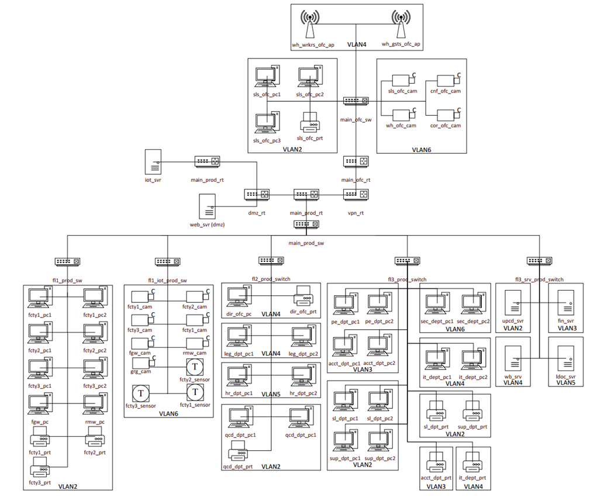

# Course Project: Computer Network Design

## Overview  
This project involves designing a computer network that includes multiple branches and production units. The goal is to create a reliable, scalable, and secure network infrastructure to support efficient management of manufacturing, logistics, and retail operations.

## Project Demo

<b>Click to expand</b>

### Simulated Network Diagram

Simulated network diagram in Cisco Packet Tracer

### Structural and Logical Diagram of the Computer Network

Structural and Logical Diagram of the Computer Network

### Floor Plan of the Administrative and Production Building

First floor plan of administrative and production building

Second floor plan of administrative and production building

Third floor plan of administrative and production building

Company's branch building floor plan

### IP Address Distribution of the Computer Network

**IP Addresses of the Administrative and Production Building Network**

| Subnet                                  | Network Address / Subnet Mask | Gateway Address  | Broadcast Address | Address Range               |
|-----------------------------------------|:-----------------------------:|:----------------:|:-----------------:|:---------------------------:|
| VLAN 2 (Production and Commercial Data) | 192.168.2.0 / 255.255.255.0   | 192.168.2.1      | 192.168.2.255     | 192.168.2.1 - 192.168.2.254 |
| VLAN 3 (Financial Accounting)           | 192.168.3.0 / 255.255.255.0   | 192.168.3.1      | 192.168.3.255     | 192.168.3.1 - 192.168.3.254 |
| VLAN 4 (Legal Documentation)            | 192.168.4.0 / 255.255.255.0   | 192.168.4.1      | 192.168.4.255     | 192.168.4.1 - 192.168.4.254 |
| VLAN 5 (Website Management)             | 192.168.5.0 / 255.255.255.0   | 192.168.5.1      | 192.168.5.255     | 192.168.5.1 - 192.168.5.254 |
| VLAN 6 (Security System)                | 192.168.6.0 / 255.255.255.0   | 192.168.6.1      | 192.168.6.255     | 192.168.6.1 - 192.168.6.254 |

**IP Addresses of the Branch Building Network**

| Subnet                                  | Network Address / Subnet Mask | Gateway Address  | Broadcast Address | Address Range               |
|-----------------------------------------|:-----------------------------:|:----------------:|:-----------------:|:---------------------------:|
| VLAN 2 (Production and Commercial Data) | 172.16.2.0 / 255.255.255.0    | 172.16.2.1       | 172.16.2.255      | 172.16.2.1 - 172.16.2.254   |
| VLAN 4 (Legal Documentation)            | 172.16.4.0 / 255.255.255.0    | 172.16.4.1       | 172.16.4.255      | 172.16.4.1 - 172.16.4.254   |
| VLAN 6 (Security System)                | 172.16.6.0 / 255.255.255.0    | 172.16.6.1       | 172.16.6.255      | 172.16.6.1 - 172.16.6.254   |

## Features  
- Design of a structural and logical network diagram with VLAN segmentation  
- Selection and justification of active and passive network equipment  
- Configuration of security measures: NAT, VPN, DMZ, wireless access with WPA2  
- Network simulation using Cisco Packet Tracer  
- Implementation of network security and monitoring solutions

## Technologies Used
- Cisco Packet Tracer - for network modeling and testing  
- VLAN, VPN, NAT, DMZ - technologies for access control and security
